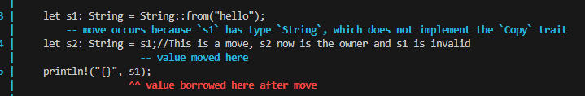

# Ownership, Borrowing, Slices

## Intro

* Ownership is rust version of memory management
* Most high level programming languages like Java or python handle garbage collection
    on their own. Very slow run time and unpredictable
* Low level programming languages give too much granularity for garbage collection
    This is very error prone and slows down production time
* Ownership is error free and memory safe but even slower write time
  * Fighting with borrow checker

## Memory

* Rust makes a stack frame at compile time
  * Variables within the stack frame must have a known fixed size
  * As variables get created they get pushed on to the stack
  * If the variable is out of scope then it leaves the stack
  * Example:

    ```rust
    fn main(){
        add();
        sub();
    }
    ```

    * Here `add()` is put on the stack, all of the variable in `add()` also gets on the stack
    * When add is done executing, it pops off the stack and so does all of its variables
* Heap Memory is done during compile time as well
  * For any dynamic sized variable, Rust will find space on the Heap
  * There is a pointer to the variable aka an address of the variable is stored on the stack
  * So to access the variable you need the address but it is still allocated on the stack in some way
  * Heap can grow and shrink during run time and is dynamic

## Scope

* Understanding scope in rust,
  * A scope is the container of visibility of information
  * A scope is typically defined within `{}` either in an expression or in a function.
  * Within a scope, a variable that is defined earlier can be seen and used by others later
  * **Lifetime** the lifetime of a variable is at most to that of the scope it resides in
    * **However, the last used case of a variable in a scope also marks its end of lifetime. This is important for borrowing**
    * When the lifetime ends of a variable, the memory for it is dropped
    * This gets more complicated and will be discussed further in later chapters

## Ownership Rules

1. Each Value in Rust has a variable thats called its owner
2. There can only be one owner at a time
3. When the owner goes out of scope, the value is dropped
Example:

    ```rust
    {//s is not valid here, there is no owner yet in this scope

        let s: String = String::from("hello"); //s is valid here and is the owner of the value "hello" on the stack

    }//The scope has now ended and s is now dropped from the stack and heap memory 
    ```

* Unlike normal programming languages, rust does not have a **shallow copy**
  * Shallow copy is when you set two pointers to the same location and both control that location at the same time. Changing one pointer would change the other
  * Rust instead uses the idea of **move**
  * Move is more memory safe. Instead of two pointers existing together, the first pointer becomes invalid, giving ownership of that address to the second pointer
  * Example

    ```rust
    let s1: String = String::from("hello");
    let s2: String = s1;//This is a move, s2 now is the owner and s1 is invalid
    println!("{}", s1); // try doing a cargo check to see what happens
    ```

    
  * Cargo check shows that `s1` is no longer the owner of "hello" address because of `move`
  * Alternatively, it suggests to do a copy if you want to use both s1 and s2 to have the same value for different addresses
    * `let s1: String = s2.copy()`
  * In the basic data types such as bools, ints, and float, all values are copied by default. Since these data types exist only in the stack and not in the heap.
  * Only values stored in the heap will not be copied by default.
* **Functions** ownership rules
  * When you pass a argument in a function, the function will take the ownership of the argument.
  * Once the function is done and the argument is now out of scope of the function body, the argument gets dropped out of the stack completely
  * Example

      ```rust
      let s1: String = String::from("hello");
      take_ownership(s1);
      println!("{}", s1); // this is an error, s1 is no longer the owner of "hello"
      fn take_ownership(s: String){
        println!("{}", s);
      }
      ```

    * Note that in this example we use a String object but an int or bool would have worked without errors due to default copying behavior
  * Returning the objects at the end of a function will give ownership away from the function
    * Example

      ```rust
      let s1: String = String::from("hello");
      let s2 : String = give_ownership(s1);
      println!("{}", s2); // this is now fine

      fn give_ownership(s: String) -> String{
        println!("{}", s);
        return s;
      }
      ```

  * You can give and take back ownership using these ideas
  * For instance you want to calculate the length of a string without giving away ownership, you can give it and take it back.
    * Example

      ```rust
      let s1: String = String::from("hello");
      let tup: (String, i32) = takes_ownership_give_back(s1);

      take_ownership_give_back(s1: String) -> (String, i32){
        let x: i32 = s1.len() as i32;
        return (s1, x);
      }
      ```

    * This idea of giving and taking back is a bit more complicated since you have to return a tuple instead of the value you want to calculate on its own.
    * This becomes tedious but it brings us to the idea of borrowing.

## Borrowing

* Borrowing is a concept of giving ownership temporarily to someone until they **drop** the ownership. Once they drop it, the ownership returns back to the original owner
* Borrowing is done by passing a reference to the new owner
* Borrowing uses the `&` operator to pass reference
* If ownership is already an object or pointer to the heap, then how does passing a reference work?
* Well lets take a look at an example
  * `let s1: String = String::from("borrowing example")`
  * `let s2: String = &s1;`
  * So now s1 points to "borrowing example" and s2 points to s1. In otherwords, its a reference to a reference.
  * You can think of it as s2 is a pointer whose value is s1, and s1 is a pointer whose value is "borrowing example"
* Let's look at an example in function calls

  ```rust
  let s1: String = String::from("borrowing example");
  borrows(&s1)
  println("{}", s1);// gets back ownership after the function call
  
  fn borrows(s1: &String){
    println("{}", s1);
  }
  ```

* **Note** that **references are immutable** by default
* **Note** you do not have to dereference the variable and you will have access to the value directly
* You can pass a **mutable reference** in order to change the underlying value
  * The object itself must be mutable and it is passed using
  `&mut` keyword
  * Example:

    ```rust
    let mut s1 : String = String::from("mutable reference");
    change(&mut s1);
    prtintln!("{}", s1);

    fn change(s1: &mut String){
      s1 = s1.push_str(", changed");
    }
    ```

  * Mutable references have some really strict rules,
    * **ONLY ONE** mutable reference to the same object can exist within the same scope
    * Lets look at an example
    * Example:

      ```rust
      let mut s1 : String = String::from("mutable reference");

      let mut s2 : String = &mut s1;
      let mut s3 : String = &mut s1;
      println!("{}, {}", s2, s3); //error 
      ```

      * Here we would get an error for having two mutable pointers to the same object, this makes sure that there is no race condition between the two mutable pointers.
      * This enforces the idea of no Shallow Copying within Rust
    * **NO MIXING** : if you have a mutable variable and you pass an immutable reference (i.e you use `&` as opposed to `&mut`) then your variable is considered to be immutable. Since the immutable reference will assume the value will not be changing within this current scope.
      * In otherwords you cannot have both a mutable and immutable reference in the same scope  
      * Lets take a look at an example

          ```rust
          let mut s1 : String = String::from("new mutable string");

          let r1 : &String = &s1;
          let r2 : &String = &s1;

          //let mut s2: String = &mut s1; error
          println!("{}, {}", r1, r2);

          let s2 : &mut String = &mut s1; 
          ```
      * Here in this example, we can see that multiple immutable references are ok, because the underlying value doesn't change
      * The first attempt of adding a mutable reference is an error because r1 and r2 are still alive and in the scope
      * Once it is their last usage within the scope (i.e. their lifetime is over) THEN we can put a mutable reference in the scope.
        * This could mean that either r1 and r2 are never used or they are used before a mutable reference is created. But once a mutable reference is created they cannot be used anymore within the scope.
      * Also consider the data types we are using here
        * The original data types are the simple ones like `String`, but burrowed data types are specifically different, `&String` and `&mut String`.
        * **NOTE:** A mutable reference is mutable by **type** such as `&mut String`. Its type is mutable and changes the underlying value of s1, so as long as s1 is `let mut` then the mutable reference need not be explicitly mutable
          * i.e. `let mut s3 : &mut String = &mut s1;` the first mut is unnecessary.

  * Dangling References:  
    * A dangling reference occurs when an object is defined in a scope and a reference to that object is to be returned out of the scope, then it is dangling
    * This is dangling because the object is dropped from memory once it is out of scope, so returning a reference to the dropped memory doesn't make sense. This is a compile error in rust
    * Example

      ```rust
      fn dangle() -> String{
        let s1 : String = String::from("foo");
        &s1 //this is dangling 
      }
      ```

    * You can fix dangling with lifetime keywords but that is for later

## Slices

* Slices let you reference a continuous contiguous elements within a collection without taking ownership of the collection
* For instance you want to keep track of the 3rd word of a string and its values but not the whole string
* Some basic rules
  * Now for all intents and purposes, you cannot mutate the slice.
  * The slice of a String object is a string literal
  * Although you only access a specific range of values within the collection, you can not change the collection as a whole until you are done with the slice
  * Although you cannot change the collection as a whole, you can reference multiple slices at the same time and the collection as long as it is all immutable and a constant underlying value
