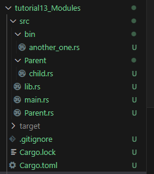

# Modules and Crates and Privacy Rules

* Note don't do this part on a company network,
* Company network makes it hard to install external packages

## Packages

* `Cargo new` creates a new Package
  * Each package can have 2 types of crates
    * Binary Crates: codes you can execute
    * Library Crates: code you can access from others
  * Each crate has Modules
    * Modules allows you organize a chunk of code and change the privacy of the code
* There is also workspaces which can hold multiple packages
* 3 Main Rules of Packages:
  * All packages must contain at least one crate
  * A package can have upto at most 1 library crate
  * A package can have any number of binary crates

## Crates

* In the `.toml` file there is no explicit crate to start
* However there are 2 automatic crates that can be created
  * If you have a `main.rs` file in the root of your src/ directory then it creates a **Binary Crate** with the same name as the package
    * The **root** of this Binary Crate will be from `main.rs`.
    * The rust compiler will start at main.rs for the crate
    * This will also make up the **root module**
  * If you have a `lib.rs` file in the root of your src/ directory then it creates a **Library Crate** with the same name as the package
    * All other conventions from the auto binary crate also will be applied for the library crate
    * A lib.rs file is not auto created with `cargo new` command
      * BUT you can auto make it if you use `cargo new --lib`
      * Note this will not make a main.rs then
* To create more binary crates outside of the automatic ones
  * You need to create a folder `bin/` inside the src/ directory
  * Each file in the bin/ folder will represent its own binary crate

## Modules

* Modules are specified using the `mod` keyword in a rust file
* Restaurant Example:

  ```rust
    mod front_of_house{
        mod hosting{
            fn add_to_waitlist(){}

            fn seat_at_table(){}
        }

        mod serving {
            fn take_order(){}

            fn serve_order(){}

            fn take_payment(){}
        }
    }
  ```

  * In this example, we have a module to represent the front of the house
  * In that module we have 2 nested modules that represent hosting and serving
  * Within the nested modules has functions
    * Within a module you can define
      * Functions
      * Structs
      * Enums
      * Traits
      * Constants
      * etc.
  * This creates a module tree for the crate and helps us organize our code
  * The root of the tree will be called `crate` which is the default root module of either lib.rs or main.rs
  * It is similar to a directory tree in linux
*
* How do we access the functions in the Modules?
* You need to use the `::` operator to give the path
* Example:

    ```rust
    fn eat_at_restaurant(){
        //Absolute Path
        crate::front_of_house::hosting::add_to_waitlist();

        //Relative Path
        front_of_house::hosting::add_to_waitlist();
    }
    ```

  * Note that this will have privacy errors, but let's focus on the paths for now
  * Here we are using two paths
    * Absolute Path
      * Needs to start at the root of the Module tree which is `crate` and then separates the scopes using the `::` operator
    * Relative Path  
      * Starts from the current module automatically
      * In this case, since we are making this function globally in the same file, then it starts at the root module `crate` by default.
        * This means that we only need to specify the path after `crate`  

#### Module Privacy Rules

* By default in rust, a child module is private to all of its parents
  * For instance, in our previous example, hosting is private to front_of_house module.
* By default, all parent modules are public to their child modules.
  * In this case,  `crate` public to `front_of_house` which is public to `hosting`.
  * This means that only child module you want needs to be accessible outside of the module since the parents will be accessible by the child.
* By default, all functions of a module are private to the module it is in and all the parents above.
* Even if a module is public, the functions and information inside the moduel is private unless specified otherwise
* This system allows us to hide implementation details by default and only expose what we want to the outside world
* To make something public we use the `pub` keyword infront of any scope or function
* Example, Let's Fix our front of house:

    ```rust
    mod front_of_house{
        pub mod hosting{
            pub fn add_to_waitlist(){}

            fn seat_at_table(){}
        }

        mod serving {
            fn take_order(){}

            fn serve_order(){}

            fn take_payment(){}
        }
    }

    fn eat_at_restaurant(){
        //Absolute Path
        crate::front_of_house::hosting::add_to_waitlist();

        //Relative Path
        front_of_house::hosting::add_to_waitlist();
    }
    ```

* Understanding paths and permissions we can utilize some shortcuts
* One thing to note, within a module, all functions at the same level are visibile to each other
* Another thing to note is the `super::` keyword, which is takes advantage of the relative path from the parent to the child.  
* `super::` takes the function of the parent.  
* Exmample:

  ```rust
    fn serve_order(){}
    mod back_of_house{
        fn fix_incorrect_order(){
            
            cook_order();
            super::serve_order();
        }
        fn cook_order(){}

    }
  ```

  * Here we call the serve_order() function from the `crate` module
  * We can also see that cook_order() is visible since it is within the same module
* **Struct and Enums Privacy**
  * Structs
    * Structs within a module are private by default
    * But so is there fields, methods, and associated functions
    * You need to be careful when accessing, mutating, or creating a struct as every part of the struct needs the `pub` keyword to be fully public
    * Example of a Struct

        ```rust
        mod cafe{
            pub struct Breakfast{
                pub toast : String,
                soup_of_the_day : String,
            }

            impl Breakfast{
                pub fn summer(toast: &str)->Breakfast{
                    Breakfast{
                        toast : String::from(toast),
                        soup_of_the_day: String::from("chowder"),

                    }
                }
            }
        }

        pub fn eat_breakfast(){
            let mut meal = cafe::Breakfast::summer("Wheat");

            // meal.soup_of_the_day = String::from("chicken noodle");
            meal.toast = String::from("Rye");

            /* Error
            let new_meal = cafe::Breakfast{
                toast : String::from("Sourdough"),
                soup_of_the_day : String::from("hot and spicy")
            };
            */
        }
        ```
      * We can notice that the struct had to be made public and so is the constructor function `summer()`
      * Also note that the `toast` field is public and can be modified but not the `soup` field
      * Even though the struct is public and the toast field is public, because the `soup` field is private we cannot make a constructor of the Struct outside of the associated function `summer()`
      * To that point, we cannot even make a constructor outside of the `cafe` module because of this.
      * The `new_meal` instance of Breakfast is going to be an error since `soup` is private.
    * This gives users more flexibility in the different aspects of visibility to the Struct
    * However it is a little more error proned  
  * Enums
    * Enums are private by default in a module however
    * Unlike a struct, all the fields/variants in an enum are public by default.
    * Meaning, as long as the enum is public, all the variants are public.
    * Example:

        ```rust
        mod Meal{
            pub enum Appetizer{
                Soup,
                Salad,
            }
        }

        pub fn order(){
            let order1 = Meal::Appetizer::Soup;
            let order2 = Meal::Appetizer::Salad;
        }
        ```
      * This example is simple but there is not much else to it, once an enum is public it is accessible
      * This is mainly due to private enum variants are not useful when programming
* **Use**
  * The Use Keyword we have seen before when importing modules or crates into a file
  * However a more true way to describe it is bringing something external into scope
  * `use` Can be used to bring modules outside of the file into scope or other Modules within the file into scope
  * Lets see an example:

    ```rust
    mod BBQ{
        pub mod hosting{
            pub fn add_to_waitlist(){}
        }
    }

    //Absolute Path
    use crate::BBQ::hosting;

    //Relative Path
    use self::BBQ::hosting;
    pub fn eat_at_BBQ(){
        
        hosting::add_to_waitlist();

        hosting::add_to_waitlist();
    }
    ```

    * So in this example we define a module called BBQ and a hosting within it
    * Now we see how we can bring the module hosting into scope
    * This is done in two different ways
    * The first way starts at the root `crate`
    * The second way is a relative path and starts with the keyword `self`
    * We could take it a step further and bring the function within hosting into scope, but rust prefers only bringing modules into scope
    * We want it to be clear where the function is coming from
  * Being clear about which module the function or Struct is being called from is very important but there is anothiner way of performing this with Structs
  * When bringing a module or struct or enum into scope that may conflict with an existing struct name, you can rename with the `as` keyword
  * `use std::io::Result as IoResult;`
  * `use std::fmt::Result as Result;`
  * Here we can see to types of Result coming into scope but we renamed one of them so that it is clear where the struct is coming from.
  * Now if we want external codes to see modules within our crate, we just need to add the `pub` keyword to the `use`
  * This will bring the scope that `use` has to external code to read.
    * `pub use self::cafe::Breakfast;`
    * Now external code will have access to Breakfast as well
  * The `use` keyword brings items into scope within our program and external dependencies into our scope
  * We can add dependencies in the `Cargo.toml` file and bring them into scope with use.
    * Example in `.toml` file:

        ```rust
        [package]
        name = "tutorial13_Modules"
        version = "0.1.0"
        edition = "2021"

        # See more keys and their definitions at https://doc.rust-lang.org/cargo/reference/manifest.html

        [dependencies]
        # ADDED DEPENDENCIES
        rand = "0.5.5"
        ```

    * Example in importing dependency into your code
      * `use rand::{Rng, CryptoRng, Errorking::Transient}`
      * Here we are using **nested paths** which is used to bring multiple **pub** childs of a parent into scope with the brackets `{}`
* **Glob Operator**
  * If you want to bring **all public fields** of a module, including other modules and functions into scope, you can use the `*` operator at the end of the `use` path
    * `use std::io::*`

#### Defining the contents of a Module in separate files

* Many times the module grows very large and you may want to dedicate an entire file to the contents of the module
* Well in rust we can define the module in a crate, while making the contents of the moduel in a separate file.
* Let's use the example and keep it in the `lib.rs`

  ```rust
  mod Parent{
      pub mod child {
          pub fn new_fn(){}
      }
  }
  ```

* Let's now move the contents of Parent to a file called `Parent.rs`
  * So in the `lib.rs` we now have the following
    * `mod Parent;`
  * So in Parent.rs we have the following

    ```rust
    pub mod child{
      pub fn new_fn(){}
    }
    ```

* And then make a folder called Parent/ in the same directory as the Parent.rs file
* Then make a `child.rs` file with the contents of child
  * So let's move the Parent.rs contents to child.rs
  * In `Parent.rs` we now have the following
    * `pub mod child;`
  * In `child.rs` we have the following
    * `pub fn new_fn(){}`
* Now we go back to the lib.rs file and we can see that there are no errors
* Your File System should look like this at the end
  * 
* Going through what each should have right now
  * Lib.rs: `mod Parent;`
  * Parent.rs: `pub child.rs;`
  * Parent/
    * child.rs: `pub fn new_fn(){}`
