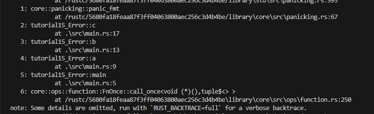
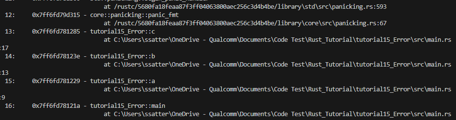

# Error Handling

* Add the following default crates into the binary

  ```rust
  use std::{fs::File, io::ErrorKind};
  use std::io::{self, Read};
  ```

## Panic

* The `panic!()` macro immediately quits the program and prints out an error message
* Example:
  * `panic!("crash and burn");`
* This gives an error message if all else fails, but doesn't give much information as to how the error came about
* For that we need to add something to our command line when running with cago
  * Run in the terminal
    * Linux: `RUST_BACKTRACE=1 cargo run`
    * Powershell: `$env:RUST_BACKTRACE=1; cargo run`
  * This allows rust to print out the error and call flow leading to the error message
  * This starts at the error and goes slowly back to the `main()`

    ```rust
    fn main() {
    println!("Hello, world!");
    // panic!("crash and burn");
    
        a();
    }

    fn a(){
        b();
    }

    fn b(){
        c(22);
    }

    fn c(i: i32){
        panic!("crash and burn");
    }

    ```

    * 
  * If you want a more verbose error trace then you can use `RUST_BACKTRACE="full"`
    * 

## Result Enum

* This is more for recoverable errors, errors that you want to handle more gracefully in the code
* The result enum represents two **variants** the `Ok(T)` or `Err(E)`
  * This is what it looks like

    ```rust
    enum Result<T, E> {
        Ok(T),
        Err(E),
    }
    ```

    * This is so common that rust includes the enum into scope by default
* Let's look at an example of how this is used
  * When we read files, the file itself needs to exist and so there is a Result enum for that
  * Example:

    ```rust
    let greeting_file_result = File::open("hello.txt");

    let greeting_file = match greeting_file_result {
        Ok(file) => file,
        Err(error) => panic!("Problem opening the file: {:?}", error),
    };
    ```

    * Here we can see that the actual return type to opening a file is a Result type
    * We can handle the two cases of the result gracefully using a match statement
    * At the success case we extract the File from the result, and the error we need to panic
* We can also handle it more gracefully using the ErrorKind enum
  * The ErrorKind enum allows us to do more than just panic when presented with the error
  * This Enum specifically allows for matching for the type of error we get
  * Quick Example:
  * Let's say we want to create a new file if it doesn't exist

    ```rust
    let greeting_file = match greeting_file_result {
        Ok(file) => file,
        Err(error) => match error.kind() {
            ErrorKind::NotFound => match File::create("hello.txt") {
                Ok(fc) => fc,
                Err(e) => panic!("Problem creating the file: {:?}", e),
            },
            other_error => {
                panic!("Problem opening the file: {:?}", other_error);
            }
        },
    };
    ```

    * Breaking it down slowly, we first pull the ErrorKind enum from the error using the `error.kind()`
      * We then match the `ErrorKind` and create a new file, but note that creating a file returns a Result Enum. Which we would have to match again
        * We then match the successful new file and the error for making the file. The error will go into a `panic!` macro
      * All the other error kinds are matched with `other_error` where we throw a more generic `panic!` macro
* Now all these match statements and exhaustively handling each case is a little hard to read and complicated. In the Chapter of **Closures** we will learn how to handle these a little better
  * As a sneak peak into how they look like

    ```rust
    let greeting_file = File::open("hello.txt").unwrap_or_else(|error| {
        if error.kind() == ErrorKind::NotFound {
            File::create("hello.txt").unwrap_or_else(|error| {
                panic!("Problem creating the file: {:?}", error);
            })
        } else {
            panic!("Problem opening the file: {:?}", error);
        }
    });
    ```

  * Closures are similar to **anonymous functions**
  * They help make the code look a lot more cleaner
* There are more useful functions on the `Result` Enum to help with the cleanliness of the code
  * There is the `unwrap` method which auto panics if there is an error or returns data if there is a success
    * `let f = File::open("hello.txt").unwrap();`
      * Here `f` is a file type because either `unwrap()` will return a file or panic out an error
  * If we want to do the same thing but give a specific `panic!` message, then we can use the `expect()` method instead of `unwrap()`.
    * `let f = File::open("hello.txt").expect("Failed to open the file");`
      * This will return a file like `unwrap()` but now also give a custom `panic!` message

## Error Propagation

* Often when there is a function that calls an error, you may want to propagate that error to the caller rather than in the callees function itself
* This gives more control to the caller on what to do with the error, this is called error propagation
* By this definition we cannot propagate an error in main as main doesn't return anything, so it is the last caller
* Error propagation is done by returning a `Result` enum
  * Example:

    ```rust
    fn read_username_from_file() -> Result<String, io::Error> {
        let username_file_result = File::open("hello.txt");

        let mut username_file = match username_file_result {
            Ok(file) => file,
            Err(e) => return Err(e),
        };

        let mut username = String::new();

        match username_file.read_to_string(&mut username) {
            Ok(_) => Ok(username),
            Err(e) => Err(e),
        }
    }
    ```

    * To understand what is going on, we first make a function that returns a Result Enum
    * The enum's generic type should return a `Ok(String)` or `Err(io::Error)`
    * Then we match the openning of a file to the file type or we **return** the error variant
      * Returning this error variant to the caller is what gives the caller more flexibility rather than panicking in the function itself
    * We then have to match the result type from reading the file where we either return the `Ok(String)` variant or `Err(io::Error)` variant.
    * This is not the recommended approach for propagating errors, as the code looks messy but this is the underlying implementation of propagation.
* This is made easier with the `?` operator
  * This operator reutrns a Result enum of the Error variant to the caller directly and exiting out the function early
  * Let's see in 3 steps how to make the function more readable using the `?` operator
  * Step 1: replacing match statements with the `?` operator

    ```rust
    fn read_username_from_file() -> Result<String, io::Error> {
        let mut username_file = File::open("hello.txt")?;
        let mut username = String::new();
        username_file.read_to_string(&mut username)?;
        Ok(username)
    }
    ```

  * Step 2: Chaining Function Calls

    ```rust
    use std::fs::File;
    use std::io::{self, Read};

    fn read_username_from_file() -> Result<String, io::Error> {
        let mut username = String::new();
        File::open("hello.txt")?.read_to_string(&mut username)?;
        Ok(username)
    }
    ```

  * Step 3: Abusing the fs Module

    ```rust
    use std::fs;
    use std::io;

    fn read_username_from_file() -> Result<String, io::Error> {
        fs::read_to_string("hello.txt")
    }
    ```
  * Also note that the `?` operator can be used with Option enums as well, but the two cannot mix and match. The `?` operator does not convert a `Result` type into an `Option` type  
  * We discussed how we cannot use the `?` operator in the main function because to propagate you need to return the `Result<String, io::Error>` however you can make main expect a return of a  result type
  * Example:
    ```rust
    use std::error::Error;
    fn main() -> Result<(), Box<dyn Error>> {
        let greeting_file = File::open("hello.txt")?;

        Ok(())
    }
    ```    
