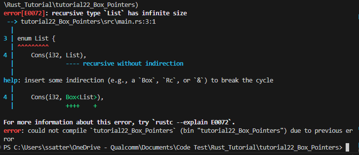

# Box Smart Pointers

## Pointers References and Smart Pointers

* A Pointer is a gerneal concept that stores data of memory address
* The most common pointers are **References** that do not have ownership and point to memory address
* **Smart Pointers** are a data structure that stores data of memory address and holds extra meta data information 
* Smart Pointers typically own the data they point to unlike references
* Common Smart Pointers that we have used before are `String` and `Vectors`
  * These are owned types and take ownership of the data it points to
  * They can manipulate the data 
  * They also hold meta data such as the length or capacity 
* Typically smart pointers are implemented like any other `Struct` but it also implements the `Deref` and `Drop` traits
* Deref allows instances of the Smart Pointer struct to be treated as references
* Drop trait allows your instance to get dropped once it is out of scope

## Box Pointers 

* A Box Pointer is just a wrapper that wraps around any data and forces the allocation to be on the heap instead of the stack 
* Example:
  ```rust
  let b = Box::new(5);
  println!("b = {}", b);
  ```
  * Here it is simple, we store the value 5 onto the heap and on the stack we store the pointer `b` who's value is the memory address of the value 5
* You would use Box Pointers in the 3 following cases:
  * When you have a type who's size is not deterministic at compile time and you want to use a value of that type which requires knowing the exact size 
  * Another case is if you have a large amount of data and you don't want it to be copied by default but rather owned and borrowed 
  * The last case is when you own a value and only care that it implements a specific `Trait` rather than a specific type. This is called a **Trait Object**
  
## Recursive Types Using Box Pointers

* Recursive types are types that uses itself as a field 
* Example:
    ```rust
    enum List {
        Cons(i32, List),
        Nil,
    }
     ```
    * Here we see that the type `List` has a variant `Cons` which binds to a tuple of `i32` and  `List`.
    * Since `List` is being used within it self, Rust cannot determine the size of the type for the enum during compile time 
    * You may be familiar with the type in functional programming languages as it forms an infite sized data structure
    * Essentially you have one value that encapsulates a linked list
    * `let x = Cons(42, (Cons 69, (Cons 61, NIL))))`    
    * Here we have a 42 -> 69 -> 61 -> NIL
* If we were to run a cargo check we can see that rust tells us exactly how to solve this problem 
  *  
  * They tell us that there is a recursive type
  * And that to fix this we need some _indirection_ 
  * Indirection means to _indirect_ the data into a Box pointer 
* Before fixing the code above, let's see how rust allocates memory for an Enum
    ```rust
    enum Message {
        Quit,
        Move { x: i32, y: i32 },
        Write(String),
        ChangeColor(i32, i32, i32),
    }
    ```
    * So this is an Enum and the size is computed by computing the size of each variant
    * So `Quit` has no size
    * `Move` is the size of 2 integers
    * `Write` is the size of a string
    * `ChangeColor` is the size of 3 integers  
    * Rust calculates which enum variant needs the most space since a variable can only represent one of these variants at a time, Rust only need to allocate at most the space of the largest variant 
* Well to compute the size of the `List` enum we have to go into the variants
* In the `Cons` Variant we see that it needs the space of `i32` and `List` which Rust then tries to compute the potential size of the `List` within `Cons`   
* We can see how the compiler recursively tries to compute the size of the `List` enum infinitely 
* The fixed version of the enum would be:
    ```rust
    enum List {
        Cons(i32, Box<List>),
        Nil,
    }

        let list = Cons(1, Box::new(Cons(2, Box::new(Cons(3, Box::new(Nil))))));

    ```
    * So how did this fix the space problem? 
    * Well now when Rust tries to compute the size of the `List` it goes into the variants
    * The `Cons` variant then instead has a `Box<List>` pointer instead of `List`
    * This means that rust will allocate a fixed size for the **pointer** which will store an **arbitrary** memory address and allocate some heap memory for the `List` within the `Box<List>`
    * Notice that even the last `Nil` needs to be stored in the Box pointer
    * Also the code is not very readable but at least everything compiles 

