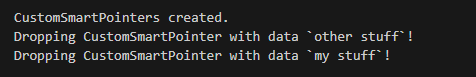
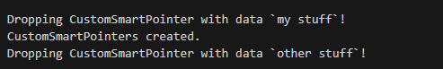

# Drop Trait

* The `Drop` trait is the second trait that all Smart Pointers need to implement in order to be a pointer
* The drop trait is what allows the value to be dropped once it is out of scope 
* When implmenting the drop trait, we can customize the behavior when its value gets de-allocated from the stack or heap
* It only has one method that needs to be implemented `drop()`
* Let's Create a simple example:
    ```rust
    struct CustomSmartPointer {
    data: String,
    }

    impl Drop for CustomSmartPointer {
        fn drop(&mut self) {
            println!("Dropping CustomSmartPointer with data `{}`!", self.data);
        }
    }

    fn main() {
        let c = CustomSmartPointer {
            data: String::from("my stuff"),
        };
        let d = CustomSmartPointer {
            data: String::from("other stuff"),
        };
        println!("CustomSmartPointers created.");
    }
    ```
    * Here we make a custom smart pointer Struct and it contains a String 
    * We then implement the `Drop` trait and its one method `drop()`
    * Here we just print the data in the method 
    * Rust will internally take care of actually freeing the data 
    * At the end when we run this program we will see that variables will be dropped in **FILO** order like a stack and we will see the prints reflect this behavior 
    * `d` will print first and then `c`
    * 
* In most cases we do not need to actually customize the behavior of dropping
* Just by implementing the `Drop` trait, rust will automatically drop the variables once it is out of scope or the program ends 

## Dropping Early

* 90% of the time, dropping at the end of the scope is the preferred and easiest and best way to drop a variable
* 10% we may want to drop a variable early, this is usually used in concurrency 
* If we have a mutex and we want to drop the lock early then we can call the `drop` method
* However we **cannot** use the `drop` method that is implemented in the `Drop` trait to drop early
    ```rust
    let c = CustomSmartPointer {
            data: String::from("my stuff"),
        };
    c.drop();
    ```
    * This is an error, because this is equivalent to calling a **double free** in C++
    * We are dropping the variable but the compiler will drop it at the end of the program as well
* Actually the rust compiler will **never** allow us to call the `drop` method from the `Drop` trait directly because it is implicitly called whenevr the scope ends 
* In order for us to call the `drop` method early, we need to use the Rust `std::` method `drop()` 
* It is used like this:
    ```rust
    drop(c);
    println!("CustomSmartPointers created.");
    ```     
    * This is a function from the standard library **NOT** a method from the trait
    * This will actually drop `c` before the print statement and then drop `d`    
    * 


