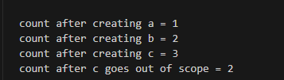

# Reference Counting 

## What is it?

* To explain reference counting, its best to use a usecase. 
  * Imagine you have a graph with nodes and edges
  * Let's say each edge has a reference to the node 
  * Now when you remove edges, you want to keep track how many are being taken away or left
  * Thus you can use **reference counting** to see how many references are there for a particular node
  * If there are no more references (i.e. edges), then you might want to drop the node entirely
* An anology to this would be, imagine that you walk into a Room and turn on the TV
  * Then many people come to watch the TV
  * People might come and go while watching TV, but as long as someone is in the room the TV should be on
  * Once no one is in the room, turn off the TV
* Going back to coding, in most cases we know which variable will retain ownership or reference in compile time 
* In those cases we can give direct ownership
* However, if for some reason we need the program to determine the ownership or references in runtime 
  * Such as when you don't know how many variables will take a reference to a value 
  * We don't know which part of the program will take ownership last
* Then We need to use the reference counting 
* This is very useful in Concurrency but for now we will use it in single threaded programs


## Using RC To Share Data

* We will start by using an example of RC
* Imagine you want to merge two `Cons` Lists into a third list 
* In this case you will have a reference of the two lists that points to the beginning of the third list.
* To start we will recall the `Cons` enum example used in the `Box_Pointers` chapter 
    ```rust
    enum List {
        Cons(i32, Box<List>),
        Nil,
    }

    use crate::List::{Cons, Nil};

    fn main() {
        let a = Cons(5, Box::new(Cons(10, Box::new(Nil))));
        let b = Cons(3, Box::new(a));
        let c = Cons(4, Box::new(a));
    }
    ```
    * First we create a Cons list with `a` of 5 -> 10 -> Nil
    * Then we make a Cons List `b` of 3 -> `a`
    * Then we have a Cons list `c` of 4 -> `a`
    * Remeber a box pointer is a smart pointer that takes ownership of the value inside
    * So when we put `Box::new(a)` we are really doing a `move` operation of `a` 
    * In other words both `b` and `c` are trying to own the pointer of `a`
    *  This is an error
    *  You might think, "If we change the definition of the `enum` then we can pass in `&List` to `Box<>` 
    * We might want to perform the following
      * `// let a = Cons(10, &Nil);`
    *  **BUT** this also doesn't work. This is because we didn't take into consideration about **lifetimes**
       *  We need the lifetime because we need to ensure that every element of the list actually lives as long as the entire list 
       *  In other words, if we pass in a reference that later on gets dropped yet the list still exists, then there would be a `null reference` error
* To fix this problem we need the `Rc<T>` (Reference Counting) smart pointer 
* First we need to bring `Rc<T>` (Reference Counting) into scope
  * `use std::rc:Rc;`
* Let's see the fixed code:
    ```rust
    use std::rc::Rc;
    enum List {
        Cons(i32, Rc<List>),
        Nil,
    }

    use crate::List::{Cons, Nil};

    fn main() {
        let a = Rc::new(Cons(5, Rc::new(Cons(10, Rc::new(Nil)))));
        let b = Cons(3, Rc::clone(&a));
        let c = Cons(4, a.clone());
    }
    ```
    * So here we replace all the `Box<>` pointers with `Rc<>` counting pointers 
    * We can see that we convert `a` itself to a counting pointer unlike last time 
    * We also see that we use `Rc::clone(&a)` which is equivalent to `a.clone()`
      * The clone function here is not a `deep copy` but rather just means the counter increases for that reference  
    * Notice we cannot do the following 
      * `let b = Cons(3, &a);`
        * The `Cons` enum is expecting an `Owned type`
      * `let b = Cons(3, a);`
        * This is also an error because we cannot borrow `a` thats already been moved
    * In short we had to do it the way we did above 

## RC counting and how it works

* To understand how the reference is counting, let's look at a more verbose version of the code
    ```rust
    fn main() {
        let a = Rc::new(Cons(5, Rc::new(Cons(10, Rc::new(Nil)))));
        println!("count after creating a = {}", Rc::strong_count(&a));
        let b = Cons(3, Rc::clone(&a));
        println!("count after creating b = {}", Rc::strong_count(&a));
        {
            let c = Cons(4, Rc::clone(&a));
            println!("count after creating c = {}", Rc::strong_count(&a));
        }
        println!("count after c goes out of scope = {}", Rc::strong_count(&a));
    }
    ```
    *     
    * Notice we use `strong_count()` method, there is also a `weak_count()` method but thats for later
    * To understand the output, when we first make `a` as a `Rc::new()` we have a reference count automatically assigned to 1
    * Then by using the `clone()` method at `b` we see that the reference count for `a` increments 
    * Similarly when using the `clone()` method at `c` we see that the reference count for `a` increments again
    * However, once `c` is out of scope and dropped from the memory, we see that `Rc::strong_count()` automatically decrements the reference count for `a` abd goes back to 2 
* `Rc` provides a workaround method for allowing multiple immutable references as an `Owned type` and provides a secure way to access a value from different objects without worrying about lifetime issues.
* **NOTE** IT DOES NOT provide a way to `mutate` the value at the reference.
  * This would break the borrow rule of multiple `mutable` references 
* However the workaround for that is `interior mutability pattern matching` 
       


