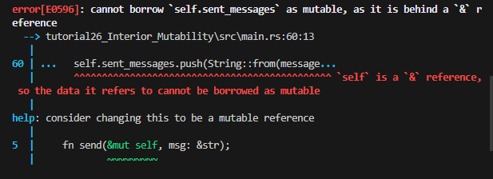

# Interior Mutablility

## Intro

* What is it? Well remember when an immutable reference is taken for a data, no matter the data type, it will become **implicitly** immutable
  * We cannot change the value of immutable references 
* Sometimes we may want to have two mutable references to the same data as well which would also break borrowing rules
* In these cases, 
  * you are using the wrong language and should find another way or use C++
  * BUT you can make rust less annoying by declaring it `unsafe`
* `Unsafe` is a chapter on its own but essentially the borrow checker rules will quiet down when doing certain things 
* This will allow you to create a roundabout way of mutating when not allowed normally
  * Keeping in mind that this is an unsafe operation

## Enforcing Borrowing Rule at Runtime

* To make the code unsafe, we will need to prevent the borrow checker from running at compile time
* We can enforce the borrow checker to check at runtime instead of compile time
* This will allow us to compile unsafe code  
* First let's discuss the `RefCell Smart Pointer`

### RefCell Smart Pointer

* The `RefCell` smart pointer will take ownership of the data like the `Box<>` smart pointer
* However, it **dynamically check borrow rules** or in otherwords check during runtime
* Checking Borrow rules at compile time is an advantage to catch bugs at an earlier time in the development stage
* Checking at Runtime will take a toll on the runtime performance and opens itself up to bugs
  * However, if you are certain that code follows borrowing rules, you may want to enforce borrow checker at runtime during the times that the compiler isn't completely certain
* Here is a recap of the reasons to choose `Box<T>`, `Rc<T>`, or `RefCell<T>`:
  * `Rc<T> `enables multiple owners of the same data; `Box<T>` and `RefCell<T>` have single owners.
  * `Box<T>` allows immutable or mutable borrows checked at compile time; `Rc<T>` allows only immutable borrows checked at compile time; `RefCell<T>` allows immutable or mutable borrows checked at runtime.
  * Because `RefCell<T>` allows mutable borrows checked at runtime, you can mutate the value inside the `RefCell<T>` even when the `RefCell<T>` is immutable.
    * This means that when you want to mutate the value inside a smart pointer like `Box` then you need to make `Box` mutable and the data you pass in
    * `Refcell<T>` does not need to be explicitly mutable, and so you can mutate the value inside without making it mutable
* Let's start with a failing example 
    ```rust
    fn main() {
        let x = 5;
        let y = &mut x;
    }
    ```
* You can imagine a case where you try to mutate the value of a particular data structure but the data structure itself is immutable 
* This is whats called **Interior Mutablility Pattern**
  * You want to make the **interior** of a particular data structure mutable but the whole appear immutable 
* The `RefCell<T>` allows you take a mutable or immutable reference from the data structure.

## Mock Objects 

* To see this use case in action, we can make a Mock Object
* A Mock Object is a testing term, this is when you make a Mock Struct that implements a trait and used for testing the functionality of the trait
* This case we will make a trait called `Messenger` which will implement a function called `send`
* We will then make a mock version that will take in a Vector of strings and we will see how the code will react the interior elements of the data structure
* Example:
    ```rust
    pub trait Messenger {
        fn send(&self, msg: &str);
    }

    pub struct LimitTracker<'a, T: Messenger> {
        messenger: &'a T,
        value: usize,
        max: usize,
    }

    impl<'a, T> LimitTracker<'a, T>
    where
        T: Messenger,
    {
        pub fn new(messenger: &'a T, max: usize) -> LimitTracker<'a, T> {
            LimitTracker {
                messenger,
                value: 0,
                max,
            }
        }

        pub fn set_value(&mut self, value: usize) {
            self.value = value;

            let percentage_of_max = self.value as f64 / self.max as f64;

            if percentage_of_max >= 1.0 {
                self.messenger.send("Error: You are over your quota!");
            } else if percentage_of_max >= 0.9 {
                self.messenger
                    .send("Urgent warning: You've used up over 90% of your quota!");
            } else if percentage_of_max >= 0.75 {
                self.messenger
                    .send("Warning: You've used up over 75% of your quota!");
            }
        }
    }
    ```
    * Here we made a messenger trait that requires an implementation of a single function 
    * Then we make a struct to track the messages called `LimitTracker`
      * Notice that it uses a generic `T` for messenger and it uses a lifetime `'a`
      * This because if you remember, whenever you set a reference type in a struct, you need to pass it a lifetime marker
        * The compiler doesn't know when the reference will die and needs to gurantee that the reference survives as long as the struct as a whole
      * We make some implementation methods for the struct to change the `value field` but for now let's focus on making a Mock Object 
    * We can see that `LimitTacker` takes in an **immutable** reference of a generic that implements `Messenger`
    * So we need to make a mock `Struct` that implements `Messenger` to test `LimitTracker` properly
* Now we will make the Mock Object test
    ```rust
    #[cfg(test)]
    mod tests {
        use super::*;

        struct MockMessenger {
            sent_messages: Vec<String>,
        }

        impl MockMessenger {
            fn new() -> MockMessenger {
                MockMessenger {
                    sent_messages: vec![],
                }
            }
        }

        impl Messenger for MockMessenger {
            fn send(&self, message: &str) {
                self.sent_messages.push(String::from(message));
            }
        }

        #[test]
        fn it_sends_an_over_75_percent_warning_message() {
            let mock_messenger = MockMessenger::new();
            let mut limit_tracker = LimitTracker::new(&mock_messenger, 100);

            limit_tracker.set_value(80);

            assert_eq!(mock_messenger.sent_messages.len(), 1);
        }
    }
    ```
    * Ok so to start we can see that we made a Struct `MockMessenger` which will help test the `LimitTracker`
    * The `MockMessenger` holds a `Vector` of `String`
    * We then notice how it implements `send()` of `Messenger`
    * It does this by **mutating** the `Vec` which is going to be a conflict
    * Why?
      * Well the function `Messenger` forces to implement is `&self` which is an immutable reference 
      * The `Messenger` generic expected for `LimitTracker` is `messenger: &'a T` which is also an immutable reference.
      * Thus creating a long chain of events that doesn't allow for `self.sent_messages.push(String::from(message));`  
    * The error itself 
      * 
    * The error shows: **cannot take mutable reference behind an immutable reference**

* Can we fix this? Yes we can change everything to mutable 
* For curiosity sake, let's show how it would work by fixing the immutable to mutable
    ```rust
    pub trait Messenger {
        fn send(&mut self, msg: &str);
    }

    pub struct LimitTracker<'a, T: Messenger> {
        messenger: &'a mut T,
        value: usize,
        max: usize,
    }

    impl<'a, T> LimitTracker<'a, T>
    where
        T: Messenger,
    {
        pub fn new(messenger: &'a mut T, max: usize) -> LimitTracker<'a, T> {
            LimitTracker {
                messenger,
                value: 0,
                max,
            }
        }

        pub fn set_value(&mut self, value: usize) {
            self.value = value;

            let percentage_of_max = self.value as f64 / self.max as f64;

            if percentage_of_max >= 1.0 {
                self.messenger.send("Error: You are over your quota!");
            } else if percentage_of_max >= 0.9 {
                self.messenger
                    .send("Urgent warning: You've used up over 90% of your quota!");
            } else if percentage_of_max >= 0.75 {
                self.messenger
                    .send("Warning: You've used up over 75% of your quota!");
            }
        }
    }


    #[cfg(test)]
    mod tests {
        use super::*;

        struct MockMessenger {
            sent_messages: Vec<String>,
        }

        impl MockMessenger {
            fn new() -> MockMessenger {
                MockMessenger {
                    sent_messages: vec![],
                }
            }
        }

        impl Messenger for MockMessenger {
            fn send(&mut self, message: &str) {
                self.sent_messages.push(String::from(message));
            }
        }

            #[test]
            fn it_sends_an_over_75_percent_warning_message() {
                let mut mock_messenger = MockMessenger::new();
                let mut limit_tracker = LimitTracker::new(&mut mock_messenger, 100);

                limit_tracker.set_value(80);

                assert_eq!(mock_messenger.sent_messages.len(), 1);
            }
        }
        ```
* BUT: For argument sakes, lets say we don't want to for 2 main reasons
  * 1. The amount of work it would take to fix is too much 
  * 2. There may be cases or types of `Messenger` that we want to be immutable 
* Maybe we just want to make the interior mutable for just the Mock Object case
* Let's fix this with `RefCell<T>`
    ```rust
    #[cfg(test)]
    mod tests {
        use super::*;
        use std::cell::RefCell;

        struct MockMessenger {
            sent_messages: RefCell<Vec<String>>,
        }

        impl MockMessenger {
            fn new() -> MockMessenger {
                MockMessenger {
                    sent_messages: RefCell::new(vec![]),
                }
            }
        }

        impl Messenger for MockMessenger {
            fn send(&self, message: &str) {
                self.sent_messages.borrow_mut().push(String::from(message));
            }
        }

        #[test]
        fn it_sends_an_over_75_percent_warning_message() {
            let mock_messenger = MockMessenger::new();
            let mut limit_tracker = LimitTracker::new(&mock_messenger, 100);

            limit_tracker.set_value(80);

            assert_eq!(mock_messenger.sent_messages.borrow().len(), 1);
        }
    }
    ```
    * Well first we need to replace the Vector of Strings to a `RefCell<Vec<String>>` 
    * Apply those changes, and then we need to change the way we want to mutate
    * When mutating the `Vec` inside the smart pointer we need to call `borrow_mut()` first
      * This will take a `&mut Vec<String>` from the smart pointer, then we can `push()`
    * We also see when checking the length of the `Vec` we use `borrow()` 
      * `borrow()` gives an **immutable** reference of `Vec`

## Runtime Borrow Checker

* Remember we are not doing a complete `unsafe` code, but a workaround 
* The borrow checker will still occur, but in runtime 
* How does this look?
  * Remember we cannot have two mutable references at the same time 
* Let's see how this works, let's try the following:
    ```rust
    impl Messenger for MockMessenger {
        fn send(&self, message: &str) {
            let mut one_borrow = self.sent_messages.borrow_mut();
            let mut two_borrow = self.sent_messages.borrow_mut();

            one_borrow.push(String::from(message));
            two_borrow.push(String::from(message));
        }
    }
    ```
    * We can see that this will compile and build
    * However let's see what happens when we run it 
    *  
    * We can see the test panics and it says `already borrowed` error, this is from borrow checker    
           

## Rc Smart Pointer with RefCell

* Recall that `Rc<T> `lets you have multiple owners of some data, but it only gives immutable access to that data
* If you have an `Rc<T> `that holds a `RefCell<T>`, you can get a value that can have multiple owners and that you can mutate!
* Let's use `RefCell<T>` with our `Cons` list example from the `Reference Counting` chapter
    ```rust
    #[derive(Debug)]
    enum List {
        Cons(Rc<RefCell<i32>>, Rc<List>),
        Nil,
    }

    use crate::List::{Cons, Nil};
    use std::cell::RefCell;
    use std::rc::Rc;

    fn main() {
        let value = Rc::new(RefCell::new(5));

        let a = Rc::new(Cons(Rc::clone(&value), Rc::new(Nil)));

        let b = Cons(Rc::new(RefCell::new(3)), Rc::clone(&a));
        let c = Cons(Rc::new(RefCell::new(4)), Rc::clone(&a));

        *value.borrow_mut() += 10;

        println!("a after = {:?}", a);
        println!("b after = {:?}", b);
        println!("c after = {:?}", c);
    }
    ```
    * Everything is more or less the same except we wrap the integers this time in an `Rc<Refcell<>>`
    * Moving forward we see that we wrap the value 5 in the `Refcell<>` and wrap all of that in a reference counter 
    * Then we clone that value in list `a`
      * Since we are cloning it with `Rc` remember that means list `a` doesn't actually contain the value of `value` but the counter for `value` increases 
      * Also remember that we are passing an **immutable** reference of `RefCell<>` which can be mutated at runtime
    * Lists `b` and `c` are then made to point to a `Rc::clone` of `a`
      * We used this exact syntax in our `Rc` chapter
    * At the end we notice that the value of `value` is first `dereferenced` with the `*` operator. This is because it is dereferencing the smart pointer `Rc<>`
      * Now we have the `RefCell<>` after dereferencing. We can take a **mutable** reference to the integer value `5` 
      * Remember up to this point, we have been giving immutable references of `RefCell` to everything 
      * But `RefCell` itself can give out mutable reference for the interior data structure.
    * After taking a mutable reference, we alter the value inside to add `10`
    * At the end of printing the lists we will see that value under all the immutable objects are changed
    * **Note** we still abide by the borrow rules. We do not have more than one mutable reference at a time and we do not move ownership 
   