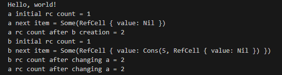
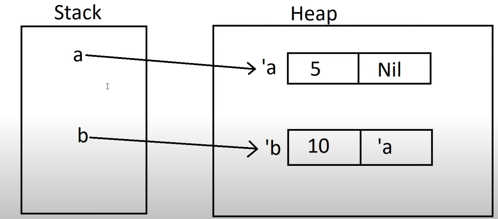
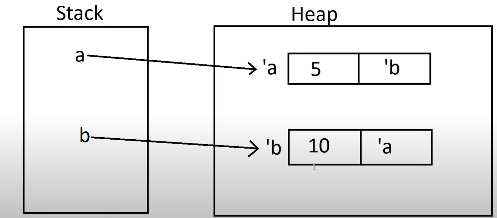
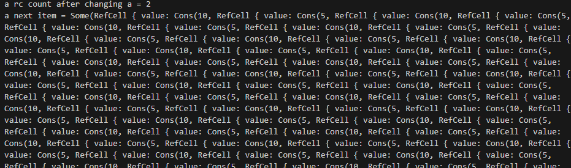
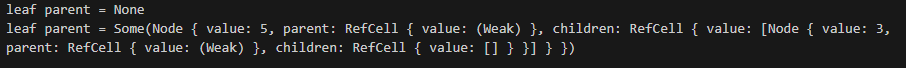
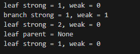

# Reference Cycles, Weak Pointers, and Trees

* First things to note is that Rust is known for being **Memory Safe**
* It provides gurantees of no data races
* However, the memory leaks is not guranteed 
* Rust makes it very difficult to cause a memory leak, and assuming you use proper ideas of Rust, you would never have to worry about them 
* Especially with automatic drops of memory
* BUT, if you combine some data structures together, if they are stretching the memory rules of Rust, together they can break through Rust's memory safety and cause leaks
* Specifically if we combine the `Rc` and `RefCell` then we can create instances of references pointing at each other causing a **Reference Cycle**

## Creating a Reference Cycles

* Let's start by using an example we have used multiple times before: the `Cons` enum 
* Our goal here is to make a runtime mutable borrow to swap out the end of the list with another list 
  * OR to change the end of the list
* Specifically we will alter it such that it can create a **Reference Cycle**
    ```rust
    use crate::List::{Cons, Nil};
    use std::cell::RefCell;
    use std::rc::Rc;

    #[derive(Debug)]
    enum List {
        Cons(i32, RefCell<Rc<List>>),
        Nil,
    }

    impl List {
        fn tail(&self) -> Option<&RefCell<Rc<List>>> {
            match self {
                Cons(_, item) => Some(item),
                Nil => None,
            }
        }
    }

    ```
    * First let's recognize how this differs from combining the `RC` pointer with the `RefCell` pointer from the previous chapter
      * Before we wrapped the `RefCell` in a `Rc`, but now we are wrapping the `Rc` in a `RefCell` 
    * We also make an implementation for the function `tail` which retrieves the tail element of `Cons`
* Now let's make our main
    ```rust
    let a = Rc::new(Cons(5, RefCell::new(Rc::new(Nil))));

    println!("a initial rc count = {}", Rc::strong_count(&a));
    println!("a next item = {:?}", a.tail());

    let b = Rc::new(Cons(10, RefCell::new(Rc::clone(&a))));

    println!("a rc count after b creation = {}", Rc::strong_count(&a));
    println!("b initial rc count = {}", Rc::strong_count(&b));
    println!("b next item = {:?}", b.tail());

    if let Some(link) = a.tail() {
        *link.borrow_mut() = Rc::clone(&b);
    }

    println!("b rc count after changing a = {}", Rc::strong_count(&b));
    println!("a rc count after changing a = {}", Rc::strong_count(&a));
    ```
    * Let's take this one line at a time
    * First we make list `a` an `Rc` pointer and have the value 5 and the `RefCell<Rc<>>` `Nil`
    * Then we print out the count of `a` which should be 1
    * THen we print the `tail` which should be `None` (remember `tail()` returns an `Option<RefCell<Rc<>>`)
    * The we initialize `b` as another `Rc` pointer but this time it holds a `10` and a `RefCell<Rc<>>` `clone` of `a` 
    * This will increment the count of `a` in the next line
    * The count of `b` will now be 1
    * The tail of `b` should be an `Option<RefCell<Rc<>>` of `a`
    * Then we use the `if let` syntax (recall from the Enum and Pattern Match chapter) to match the `tail()` of `a`
      * We use this because we need only the `Some()` variant of the `Option<RefCell<Rc<>>`
    * Once we match the `Some()` and bind the `RefCell<Rc<>>` to `link`
      * We can derefernce `link` and take a `mutable reference` of `Rc`
      * We now set `Rc<>` value of the `tail` of `a` to a `clone()` of `b`
        * Which if you remember, `b` is also an `Rc<>` type 
    * Then we print the count of `b` which should now be 2
    * And the count of `a` should also be 2
      *        
* Now it seems like we formed a `cycle` since the tail of `b` -> `a` and the tail of `a` -> `b` 
  * To demonstrate this, best to look at how it is stored
  * 
  * 
* So the cycle is present but the problem is not exposed yet because at runtime we have not accessed the `tail` of `a` or `b` since after the `if let` statement
* If we were to attempt to access the `tail` of `a`, we would get an error of `stack overflow` because of the constant cycle between `a` and `b` 
* Why is this?
* Let's say we want to access `a.tail()` to modify, print, or anything etc. 
  * This will access `b` which part of `b` is `a`. 
  * So when printing `b` we need to print `a` and then to print `a` we need to print `b`.
  * This will continue until stack overflow happens
* If you want to try, test out the following line of code:
    ```rust
    // Uncomment the next line to see that we have a cycle;
    // it will overflow the stack
    println!("a next item = {:?}", a.tail());
    ```
    *     
    * We can see it keeps trying to print the whole data structure and it goes in cycle and cycle 
* BUT this overflow error is not the biggest problem
* Our biggest problem is the memory leak that occurs with reference cycle
* How can this happen when Rust drops values automatically? How could there be leaks?
  * Well, let's look at the memory perspective
  * At the end of `main()` we will first drop `b` from the stack
  * **But** the heap memory cannot be dropped, because `a` pointer is part of it and is not dropped yet
  * Then `a` stack pointer is dropped but the heap again is not dropped because part of the heap memory for `a` is `b`'s heap memory location which still exists
  * Therefore we end up with the heap still containing `b`'s heap memory and `a`'s heap memory 
  * And thus we have a memory leak
* A Reference Cycle is considered a bug and a logical error to arriving at a solution
* You should probably avoid it and detect it using testing tools in rust

## Weak Pointers and Tree Data Structures

* Up until this point we have used `Owned Smart Pointers` or `Strong Pointers` but there are also `weak pointers` 
* Before we get to what is a **Weak Pointer** let's create a `Tree` data structure 
* We will make a `Tree` structure with just a Node struct. Alternatively we could have made a `Node` struct and a `Tree` structure but for now let's just Node
    ```rust
    use std::cell::RefCell;
    use std::rc::Rc;

    #[derive(Debug)]
    struct Node {
        value: i32,
        children: RefCell<Vec<Rc<Node>>>,
    }
    ```
    * First we make a `Node` struct 
    * Then we make two fields `value` (commonly known as `data`) and `children` 
    * `Children` is a Vector of Nodes, the Nodes are wrapped in an `Rc` because we may want other objects to be able to point to the Node instance 
      * The vector is wrapped in an `RefCell` because we may want to mutate the vector later on
      * **Note** this example is contrived to be weird because normally we would just make Vec a mutable reference to start. 
    * Also note that we still see the forbidden pattern of `RefCell<Rc<>>` in some form in this data structure
* Next let's see a simple example of creating a 2 node Tree
    ```rust
    let leaf = Rc::new(Node {
        value: 3,
        children: RefCell::new(vec![]),
    });

    let branch = Rc::new(Node {
        value: 5,
        children: RefCell::new(vec![Rc::clone(&leaf)]),
    });
    ```    
    * So first we make a `leaf` Node that holds `data` but no children
    * Then we make a `branch` Node which holds `data` and a single child which is an `Rc` clone of `leaf`
    * Notice both leaf and branch are `Rc` smart pointers
* Now there is no cycle here because a branch can reference it's children, but the children cannot reference its parent nodes. 
* But before that lets talk about what is a **Strong Pointer**
  * When a `Strong Pointer` is made it has ownership of its data 
  * When a `Strong Pointer` is dropped and all Strong pointers to a data is dropped, then the data will automatically be dropped
* What is a **Weak Pointer**
  * When a `Weak Pointer` is created, it doesn't own the data it contains. It simply references it
  * So when a `Weak Pointer` is references a data that it doesn't own, the data may or may not exist
    * So it needs a special method to getting that data 
  * This also means that when a `Weak Pointer` is dropped, the data is not dropped only the `weak` reference is dropped.
* Data will live as long as there is at least **1 Strong Pointer** that points to the data
* Using this idea, let's see how this plays a role in the `Tree` data structure
* `Parents` should always own their children. If a `Parent` gets dropped, then the `children` should also be dropped
* HOWEVER, children should not own their parents. When a `Child` gets dropped, the `Parent` may have more `Children` and needs to stay alive
* If we were to ignore this and wrote the following:
    ```rust
    use std::cell::RefCell;
    use std::rc::{Rc};

    #[derive(Debug)]
    struct Node {
        value: i32,
        parent: RefCell<Rc<Node>>,
        children: RefCell<Vec<Rc<Node>>>,
    }
    ```
    * There is no compile time error but there is a possible memory leak here
    * The problem here is that a `Node` can reference it's `parent` using a `String Pointer Rc<>` 
    * AND `Parent` references it's `children` using a `String Pointer Rc<>` 
    * This is where a `Reference Cycle` can be produced
    * This could lead to a **memory leak** and it is also a logical error
* Instead let's make use of the `Weak Pointer`     
    ```rust
    use std::rc::{Rc, Weak};
    struct Node {
        value: i32,
        parent: RefCell<Weak<Node>>,
        children: RefCell<Vec<Rc<Node>>>,
    }
    ```
* To understnad how the `Weak<Node>` works, let's look at the way we use it in main()
    ```rust
    let leaf = Rc::new(Node {
        value: 3,
        parent: RefCell::new(Weak::new()),
        children: RefCell::new(vec![]),
    });

    println!("leaf parent = {:?}", leaf.parent.borrow().upgrade());

    let branch = Rc::new(Node {
        value: 5,
        parent: RefCell::new(Weak::new()),
        children: RefCell::new(vec![Rc::clone(&leaf)]),
    });

    *leaf.parent.borrow_mut() = Rc::downgrade(&branch);
    
    println!("leaf parent = {:?}", leaf.parent.borrow().upgrade());
    ```
    * First notice that when we don't have a `weak pointer` yet, we can use `Weak::new()`
    * This will create an empty pointer to match any missing type 
    * Everything else is the same and then we try making a reference for the leaf to point to the parent 
      * Notice since `leaf` is an `Rc` we need to `dereference` it first, then we access the `parent` field 
      * `parent` is a `RefCell` so we can take a mutable reference
      * Then on the otherside notice we use `Rc::downgrade()` meaning we previously had a `Strong Pointer` and are now `downgrading to Weak Pointer`
      * This brings us to an important aspect of **Weak Pointers** which is that there **must be** a **Strong Pointer** first to create the data structure and then other pointers to the data structre can be **either** Strong or Weak Pointers
        * `Weak::new()` does not allow us to create pointers to data, only empty pointers
      * Also notice that `downgrade` takes an **immutable** reference specifically from a `Rc` strong pointer 
    * Now we can look at the print statements 
      * When printing the `parent` property of a `leaf`, notice that we do not dereference because it is a print
      * Also note, that we do a `borrow()` of the `RefCell<>` to get an immutable reference to the `Weak<>` pointer
      * Then we use `upgrade()`
      * `Upgrade` is the only way to see or access or mutate a value within a `Weak<>` pointer
        * `Upgrade()` returns a strong pointer reference of the weak pointer
          * Specifically it returns a `Option<RC<>>` 
          * It's an `Option<>`first because a weak pointer could be pointing at a dropped or null reference 
          * In the case that reference was dropped then `Option<>` would return `None`
          * Otherwise it will return `Some(Rc<>)` which we can match and use later 
      * 
      * Notice we are making a reference cycle, in the sense that we print out the parent of `leaf` which would include the leaf in itself 
      * HOWEVER, since `Weak` pointers cannot access the values directly without `upgrading` when you print a data structure that contains a `Weak Pointer`, it will just print `Weak` as the value since it has no direct access to the values 

## Strong and Weak Reference Counting 

* We have seen `Rc::strong_count()` before and we mentioned that there is a `weak_count()` in the reference counting chapter
* Now that we know the difference between the two reference types we can discuss the difference in the count
* `Rc::strong_count()` is a counter for all Strong Pointers that point to the same space in memory 
* `Rc::weak_count()` is a counter for all Weak Pointers that point to the same space in memory
* And we know we can have multiple of both for the same space, i.e. we can have 2 Strong Pointers of a Node and 3 Weak Pointers of the same Node
* Now this helps us keep track of how many pointers we have and of each type for one space in memory
* But there is another usecase. Remember that Weak Pointers require that at least one Strong Pointer is present
* Rust will automatically deallocate memory **if and only if** there is **zero** Strong Pointers pointing at the memory. i.e. `Rc::strong_count()` is 0
* This means that if you still have a Weak Pointer when `strong_count() == 0`, then it will be pointing to deallocated memory
* This is why you need to keep track of the count of both and why the Weak Pointer returns an `Option<Rc<>>` instance whenever accessing the underlying data
* Let's Practice with an Example:
    ```rust
    fn main() {
        let leaf = Rc::new(Node {
            value: 3,
            parent: RefCell::new(Weak::new()),
            children: RefCell::new(vec![]),
        });

        println!(
            "leaf strong = {}, weak = {}",
            Rc::strong_count(&leaf),
            Rc::weak_count(&leaf),
        );

        {
            let branch = Rc::new(Node {
                value: 5,
                parent: RefCell::new(Weak::new()),
                children: RefCell::new(vec![Rc::clone(&leaf)]),
            });

            *leaf.parent.borrow_mut() = Rc::downgrade(&branch);

            println!(
                "branch strong = {}, weak = {}",
                Rc::strong_count(&branch),
                Rc::weak_count(&branch),
            );

            println!(
                "leaf strong = {}, weak = {}",
                Rc::strong_count(&leaf),
                Rc::weak_count(&leaf),
            );
        }

        println!("leaf parent = {:?}", leaf.parent.borrow().upgrade());
        println!(
            "leaf strong = {}, weak = {}",
            Rc::strong_count(&leaf),
            Rc::weak_count(&leaf),
        );
    }
    
    ```
    * Ok there's a lot going on but its the same logic as before 
    * We are just printing the counts for `leaf` and `branch` both weak and strong
    * First when we initialize `leaf`, we print the strong and weak counts
      * Strong is 1 because it is initailized as an Rc<> strong pointer
      * Weak is 0
    * Then we make an **inner scope**
      * We put `branch` inside and initialize it there
      * Then we make `leaf` a child of branch using a `Rc<>` strong pointer
      * Then we reassess the counts
      * Branch has 1 Strong pointer and 0 Weak pointer
      * Leaf has **2** Strong Pointer and 1 Weak Pointer
    * Then outside the scope, remember `branch` Strong Pointers within the scope would be dropped which in this case means just 1.
    * Since Branch had only 1 in the scope and dropped to **0** Strong pointers, when we access the `parent` of leaf, we get `None`.
      * Without any strong pointers alive for `branch`, the whole data was dropped automatically
      * So all the weak pointers of `branch` are now pointing to `None`
    * In the last print statement we will see that the `strong_count` of `leaf` has also decreased by 1.
      * Since `branch` was dropped, so was all the `Strong Pointers` it contains including in `Children`
    * The `weak_count()` in `leaf` is 0 as it was before since it's not a parent of anything
    *   

