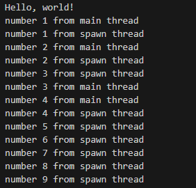

# Creating Threads 

## Using Threas

* Within a program independent running parts are called threads
* Splitting the computation into multiple threads can increase performance
* We need to be careful about raising race conditions and deadlocks 
* There are two types of threads: 
  * 1:1 thread means that when you create a thread that maps to an operating system thread
    * More efficient and less runtime expense
    * Given in the Standard Library
  * m:n thread, Green thread do not have mapping to operating system threads, this means you can spawn any number of green threads that map to any number of operating system thgreads
    * Less efficient and greater runtime expense
    * Not given in the Standard Lib, but given in external crates

## Creating a new Thread with Spawn

* Example for creating a new Thread
    ```rust
    use std::thread;

    fn main() {
        println!("Hello, world!");
        thread::spawn(||{
            for i in 1..10{
                println!("number {} from spawn thread", i);
                thread::sleep(Duration::from_millis(1));
            }
        });

        for i in 1..5{
            println!("number {} from main thread", i);
            thread::sleep(Duration::from_millis(1));
        }

    }
    ```
    * Note that when spawning a thread we use Closures which are anonymous functions as discussed in tutorial 19.
    * We can also see that we can make the child thread sleep as well as the main thread
    * Note that the execution order between the child and main thread in undeterministic as it is concurrent. 
    * Although the spawn thread ranges from 1 to 9 it will only run until 5 milliseconds as the main thread shutsdown after 5 milliseconds
      * This is because when the main thread is done, then the spawned thread will be stopped immediately regardless of its state 
* We can modify the behavior so that the main thread waits for the spawn thread to finish, in concurrency this is called **join** 
  * When joining you are joining the spawn thread back with the main thread at once it is finished and the main thread will wait until its joined back before continuing 
  * In rust we take a return type of the thread called `JoinHandle<()>`
  * A `JoinHandle<()>` can hold the return type and call join for the thread
  * Example:
    ```rust
    fn main() {
        println!("Hello, world!");
        let handle = thread::spawn(||{
            for i in 1..10{
                println!("number {} from spawn thread", i);
                thread::sleep(Duration::from_millis(1));
            }
        });

        for i in 1..5{
            println!("number {} from main thread", i);
            thread::sleep(Duration::from_millis(1));
        }

        handle.join().unwrap();

    }
    ```   
    * Here we can see that we `let handle` be the return type of the thread 
    * `handle` can then grasp the return value as well as unwrap because `join` returns a `Result<>` type in case of any failure 
    * Also note that calling join effectively blocks the current thread until the spawn has completed and joined back with current thread.
      * Output:  

## Using Move Closures with Threads

* As a reminder move closures are closures that take a variable from the outer scope and moves it implicitly within the closure scope
  * Remember that it borrows either `FnOnce` or `Fn` or `FnMut` 
* Example of a move Closure
    ```rust
    let v = vec![1, 2, 3, 4, 5];
    let handle = thread::spawn(||{
        println!("Here's a vector: {:?}", v);
    });
    drop(v); 
    handle.join().unwrap();
    ```
    * This gives us an error. Not because of borrowing or moving but because of lifetime
    * Remember that the thread runs independently of the main thread and there is no guarantee that the `v` vector will not be dropped before the thread is done 
      * In otherwords it is unsafe to move `v` in this scenario 
    * The way rust gives the closure the value `v` by default is a reference to `v` so it uses `Fn` trait. 
* We can forcibly make rust use the `FnOnce` trait to move the entirety of `v` into the closure rather than just a reference. This means that the main thread no longer is able to mutate or change or drop `v`     
* Example:
    ```rust
    let v = vec![1, 2, 3, 4, 5];
    let handle = thread::spawn(move ||{
        println!("Here's a vector: {:?}", v);
    });
    //drop(v); compile time error
    handle.join().unwrap();
    ```
    * Now there is no error and the attempt to drop `v` in the main thread would result in an error    